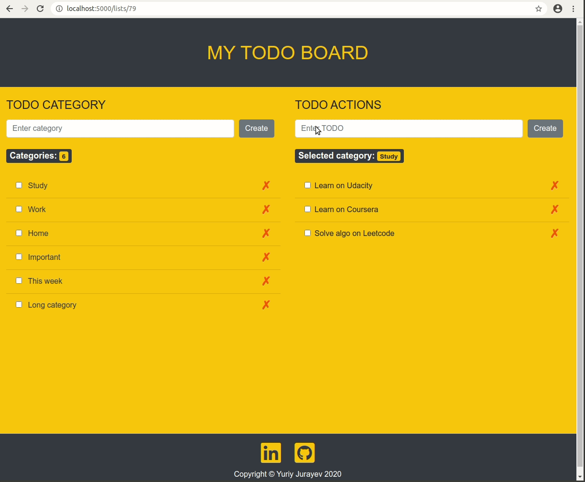
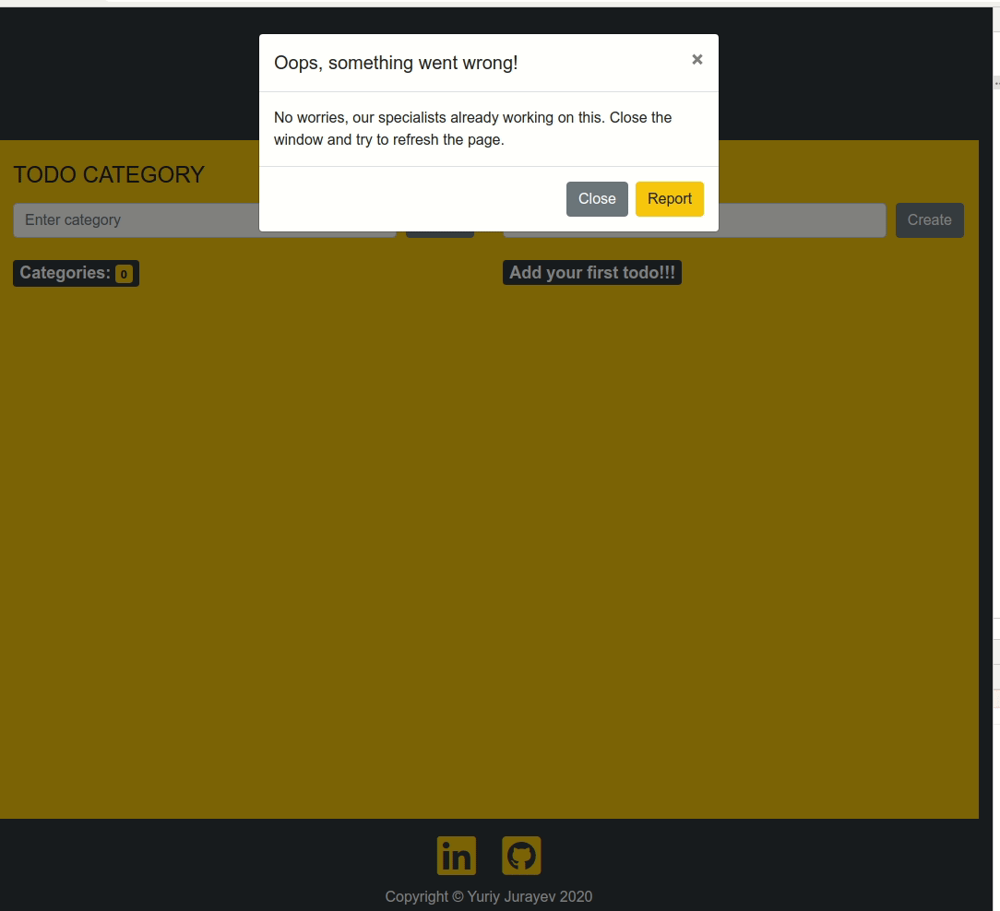

# TODO BOARD
Full-Stack TODO application. Add your todo task, save as a specific category, and enjoy. 

Built with Python3+, Flask, SQAlchemy, PostgresSQL, MVC, Bootstrap/HTML/CSS

## Live Demo

## Features

### TODO CATEGORY
 * Add a new category
 * Check/Uncheck completed category that completes all todos belong to this category
 * Delete category. Also deletes all todos in this category
 * Categories counter

### TODO ACTIONS 
 * Add a new todo
 * Check/Uncheck todo. If all todos are completed, the category also is checked completed
 * Delete todo
 * Selected category label

### Errors
When an error occures either on Front End or Back-End part a user is notified with further instructions
 * Display a modal window with the error message
 * User has an option to Close or Report the error
 

## Dependencies
* Python 3+
* Flask==1.1.2
* psycopg2-binary==2.8.3
* Flask-Migrate==2.5.2
* Flask-SQLAlchemy==2.4.0
* Postgresql

## Installation

1. Clone the project repository: 

   `git clone https://github.com/jurayev/todo-app.git`

2. Go to project folder: 

   `cd todo-app`

3. Install dependencies: 

   `pip3 install -r requirements.txt`

## Usage

### Execution
1. Run application: 

   `$ FLASK_APP=app.py FLASK_DEBUG=true flask run`
   
   or
   
   `$ python3 app.py`
   
2. Navigate to:

   `localhost:5000`
   
3. Stop application: 

   `ctrl + c`

## Roadmap

Future TODOs:
* Possibility to update a record
* Add geeting and basic usage modal window
* Add unit tests

## Contributing
Pull requests are welcome. For major changes, please open an issue first to discuss what you would like to change.

Please make sure to update tests as appropriate.

## License

The content of this repository is licensed under a [MIT License.](https://github.com/jurayev/todo-app/blob/master/LICENSE.md)

